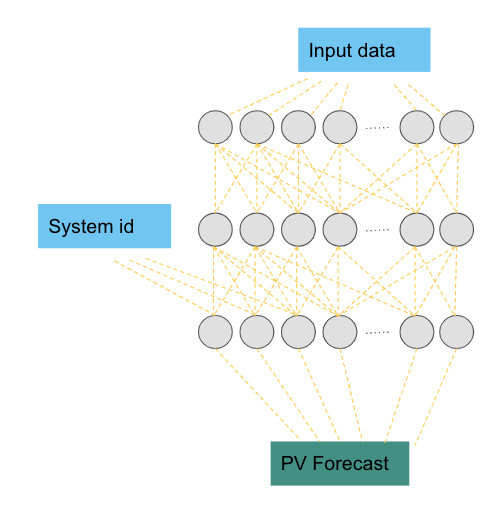
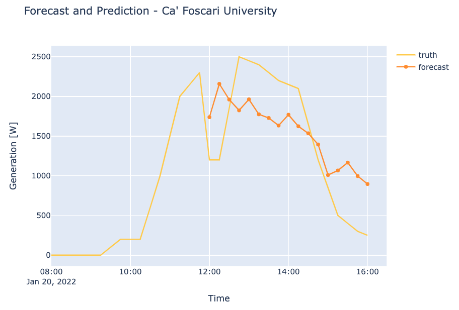

# SV Pilot

## Summary

We forecasted PV production over the next 4 hours for 4 sites in Italy. The average error was XXX. 

## Data

#### Sites

We are forecasting for four sites across Italy. 

|    | Location | Capacity [kW]
| ----------- | ----------- | --- |
| 1      | Belluno       | 35
| 2   | Bari        | 25
| 3   | Bari        | 20
| 4   | Venice        | 20 

#### SV specific filtering

The following filters were used.

1. We removed any negative value
2. Remove any values above 10^6
3. Remove any values above mean + 5 stds. This gets rid of any anomalies
4. Remove specific datetimes for site 4 (Universita Ca Foscari), 2021-06-09 to 2021-07-12

### PVoutput.org

We downloaded 436 sites from Italy from [PVoutput.org](https://pvoutput.org/region.jsp?country=117). 

### NWP 

We have collected GFS data over the whole of Italy, using a 1/4 degree grid. The following variables has been used. 
- dlwrf ( downward ): This is a fairly inaccurate prediction of solar irradiance. 
- t (temperature): The air temperature at ground level
- prate (perciptation rate): The amount of rainfall
- u,v: The 2 dimensional wind speed direction at the ground. 

### General

We add the sun's azimuth and elevation angle as a model input. 
This is highly predictable and clearly has strong correlation with pv production 

We also normalized the data by the pv system capacity value. This normalizes the pv production, so all values are between 0 and 1. 
The NWP variables have also been normalized. 

## Models

### Baseline

It is always good to baseline the models with some very simple models, 
in order to get an understanding of the statistics. 

The following different baselines were looked at:
- Zero: Always predict zero 
- Persist: Use the last values for the forecast of the 

See results [here](SV_pilot.md#Results).  

###  PV-FC 

The idea is to use a 3 hidden layered of FC (full connection) neural network. 
PV ID has also been embedded in the network, so that the model learns which PV system the prediction is for. 

This takes all the inputs above, passes them through the layers and 
then produces predictions at 15 mins intervals for the next 4 hours.

## Training

We divided the data into 2021 and 2022. 
We trained our models using 2022, and then validated our results on 2021.

Training our models took approximately 1 hour. 

Figure shows how the loss decreases during a several training runs. 

## Results

The table below shows the different models metrics for MAE and MSE.

|               | MAE [%]   | MSE [%] | link
| -----------   | --------- | --- | --- |
| Zero          | 10.07      | 4.26 | [baseline1](https://wandb.ai/openclimatefix/pv-italy/runs/13xw5y6p)
| Persist       | 6.96       | 2.1 | [baseline2](https://wandb.ai/openclimatefix/pv-italy/runs/2b2wjxww)
| SV sites only | 2.51      | 0.374 | [pv_sv](https://wandb.ai/openclimatefix/pv-italy/runs/3aix2ijd)
| SV + 10 sites |           |    | [pv]()
| PV and NWP    |           |    | [nwp](https://wandb.ai/openclimatefix/pv-italy/runs/2ekjl5ld)

Below shows some example predictions of PV systems. The blue line is the truth and the red line is the foreacst. 
Note the last 4 hours of true PV values are also shown.

## Next Steps

### Data Satellite

It would be great to use Satellite information aswell and our models could easily be extended in the future.
In previous models with have seen 16% in accuracy.  

### Models

We would like to use some deep neural networks to enchance our results. 

1. PVnet - [link](TODO WP2 report)
2. Metnet - [link](https://arxiv.org/abs/2003.12140)

Both these methods would allow a lot more spatial data to be used to make the predictions more accuracy. 
