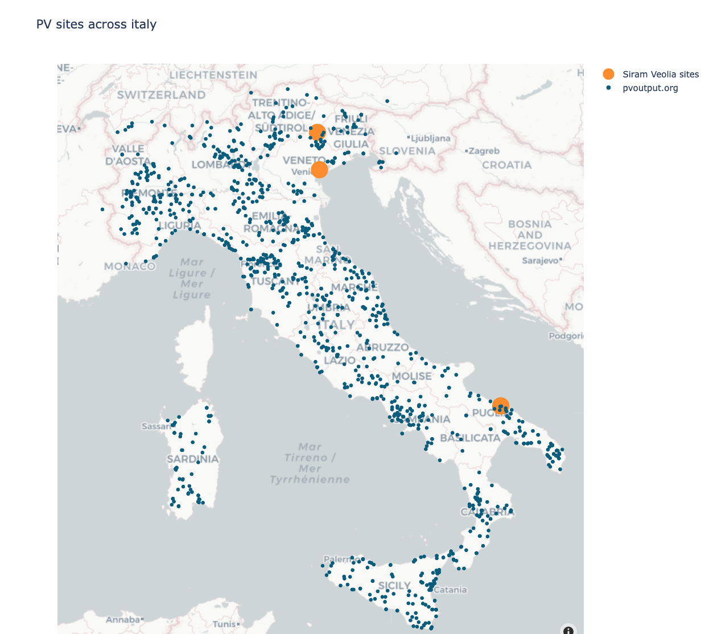
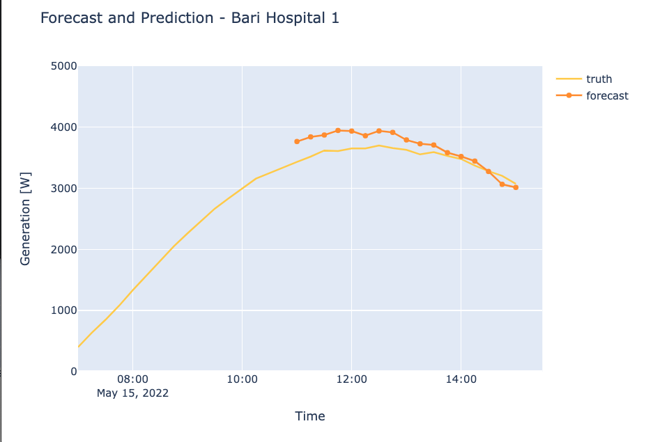
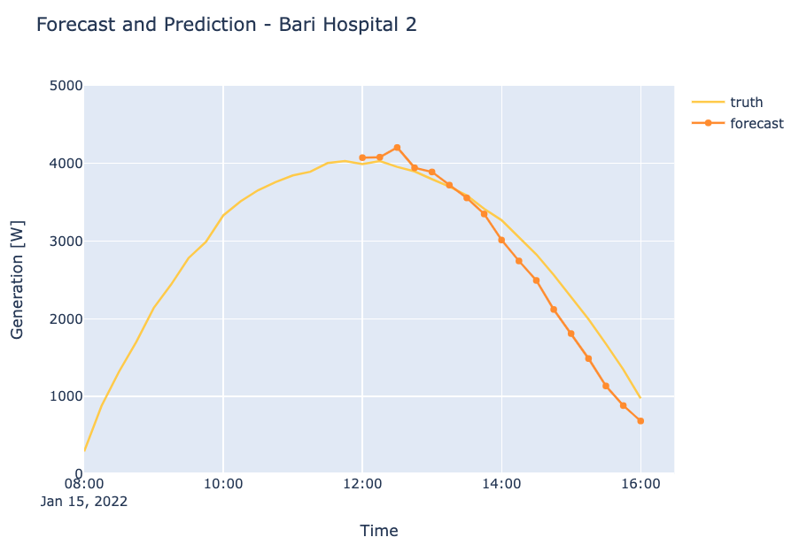
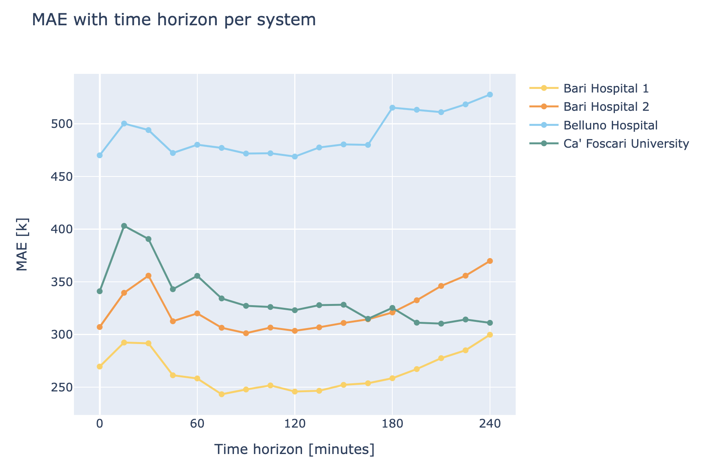

# SV Pilot

## Summary

We forecasted PV production over the next 4 hours for 4 sites in Italy. The average error of the forecast was 348 Watts.

## Data

#### Sites

We are forecasting for four sites across Italy. 

|    | Location | Capacity [kW]
| ----------- | ----------- | --- |
| 1      | Belluno       | 35
| 2   | Bari        | 25
| 3   | Bari        | 20
| 4   | Venice        | 20 

#### SV specific filtering

The following filters were used.

1. We removed any negative value
2. Remove any values above 10^6
3. Remove any values above mean + 5 stds. This gets rid of any anomalies
4. Remove specific datetimes for site 4 (Universita Ca Foscari), 2021-06-09 to 2021-07-12

### PVoutput.org

We downloaded 436 sites from Italy from [PVoutput.org](https://pvoutput.org/region.jsp?country=117). 
This allows the model to learn how the PV sites are performing near the SV sites. 
The following figure shows where all the PV sites are located. 

### NWP 

We have collected GFS data over the whole of Italy, using a 1/4 degree grid. The following variables has been used. 
- dlwrf ( Downward Long-Wave Radiation Flux ): This is a fairly inaccurate prediction of solar irradiance. 
- t (Temperature): The air temperature at ground level
- prate (Precipitation Rate): The amount of rainfall
- u,v: The 2 dimensional wind speed direction at the ground. 

### General

We add the sun's azimuth and elevation angle as a model input. 
This is highly predictable and clearly has strong correlation with pv production 

We also normalized the data by the pv system capacity value. This normalizes the pv production, so all values are between 0 and 1. 
The NWP variables have also been normalized. 

## Models

### Baseline

It is always good to baseline the models with some very simple models, 
in order to get an understanding of the statistics. 

The following different baselines were looked at:
- Zero: Always predict zero 
- Persist: Use the last values for the forecast of the 

See results [here](SV_pilot.md#Results).  

###  PV-FC 

The model used is a 3 hidden layered of FC (full connection) neural network. 
PV ID has also been embedded in the network, so that the model learns which PV system the prediction is for. 

The model takes all the inputs above, passes them through the neural nework layers and 
then produces predictions at 15 minutes intervals for the next 4 hours.

The illustraction below show how the input data is feed into the network and how forecast are made. 

## Training

We divided the data into 2021 and 2022. 
We trained our models using 2021, and then validated our results on 2022. 
Note that during validation we only use a random subset of 2022, rather than the whole year. 
For inference we used the entire dataset from 2022. 

Training our models took approximately 1 hour. 

This figure shows how the error between forecast and truth decreases during a several training runs. 

## Results

The table below shows the different metrics for MAE and MSE for the baseline and two different models.

|               | MAE [%]   | MSE [%] | link
| -----------   | --------- | --- | --- |
| Zero          | 10.07     | 4.26 | [baseline1](https://wandb.ai/openclimatefix/pv-italy/runs/13xw5y6p)
| Persist       | 6.96      | 2.1 | [baseline2](https://wandb.ai/openclimatefix/pv-italy/runs/2b2wjxww)
| PV only       | 2.95      | 0.474 | [pv](https://wandb.ai/openclimatefix/pv-italy/runs/3aix2ijd)
| PV and NWP    | 2.24      |  0.0294  | [pv_nwp](https://wandb.ai/openclimatefix/pv-italy/runs/2ekjl5ld)

Below shows some example predictions of PV systems. The blue line is the truth and the red line is the forecast. 
Note the historic 4 hours of true PV values are also shown.

Example of two good predictions

The next plot shows an example of a less good predictions, 
this particular example would be improved with satellite images

## Inference

We have saved a forecast from 2022-01-01 to 2022-10-01 at 15 minute time intervals to 4 hours ahead. 

The table below shows the forecast acuracy for each site. 

|    | Location | Capacity [kW] | MAE [kW] |
| ----------- | ----------- | --- | --- | 
| 1      | Belluno       | 35 | 0.490
| 2   | Bari        | 25 | 0.264
| 3   | Bari        | 20 | 0.324
| 4   | Venice        | 20  |  0.334

The figure below shows the accuracy of the predictions for each system, for different time horizons. 
A different loss function is needed to increase the accuracy of the first few time horizons steps. 

## Next Steps

### Data Satellite

It would be great to use Satellite information as well and our models could easily be extended in the future.
In previous models with have seen 16% increase in accuracy.  

### Training

The models are currently only trained for a limited number of epochs. 
For some models, we did not see any over fitting to the training data, 
therefore it would be good to extend training to reduce the errors even more. 

It would be good to use a loss function that focuses the model on the first few time horizons, as these should be simpler to predict.

### Models

We would like to use some deep neural networks to enchance our results. 

1. PVnet - [link](TODO WP2 report)
2. Metnet - [link](https://arxiv.org/abs/2003.12140)

Both these methods would allow a lot more spatial data to be used to make the predictions more accuracy. 
